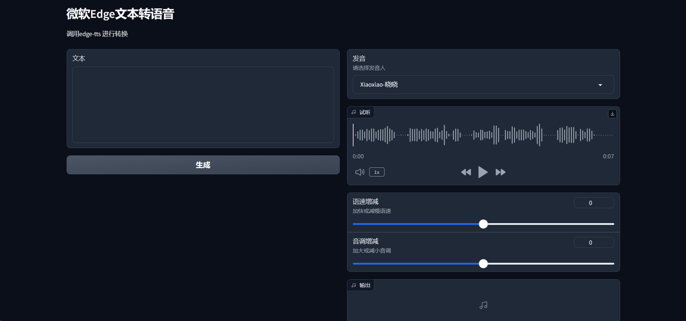

# edge-tts-webui

`edge-tts-webui` 是 [edge-tts](https://github.com/rany2/edge-tts)的web界面版，使用`gradio`开发



## 安装

    edge-tts
    gradio

## 运行

    python app.py

## 使用

浏览器访问
```
localhost:7860
```